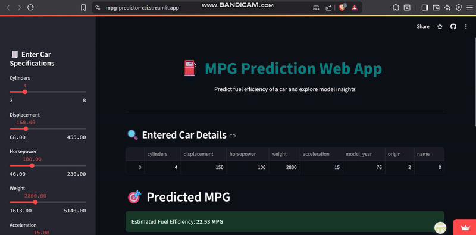

# 🚗 MPG Prediction Web App with Streamlit

A simple, interactive Streamlit web application that predicts **Miles Per Gallon (MPG)** for automobiles using a trained machine learning regression model.

The app allows users to:
- Input car attributes (e.g., horsepower, weight, cylinders)
- Receive instant MPG predictions
- Understand the model's behavior through visualizations including feature importance and partial dependence plots

---
## 🎥 Sample Demo

## 📊 Dataset

The application uses the **MPG dataset** from `seaborn`, which contains information on various car models such as:
- Cylinders
- Displacement
- Horsepower
- Weight
- Acceleration
- Model year
- Origin

---

## 🔍 Features

- 🚀 **Real-time Prediction** of MPG
- 📉 **Model Interpretation** via:
  - Feature importance plot
  - Partial dependence plots using `sklearn.inspection.PartialDependenceDisplay`
- 📱 Clean and interactive **Streamlit UI**
- ✅ Trained **Random Forest Regressor**

---

## 🧠 Model Used

- **Random Forest Regressor**
- Trained using `scikit-learn` on selected features from the MPG dataset

---

## 📦 Installation & Setup

1. **Clone the repository**

git clone https://github.com/your-username/CSI25_Data_Science.git
cd Assignment_week7/app.py

---

2. **Install requirements**

pip install -r requirements.txt

---

3. **Run the app**

streamlit run app.py
